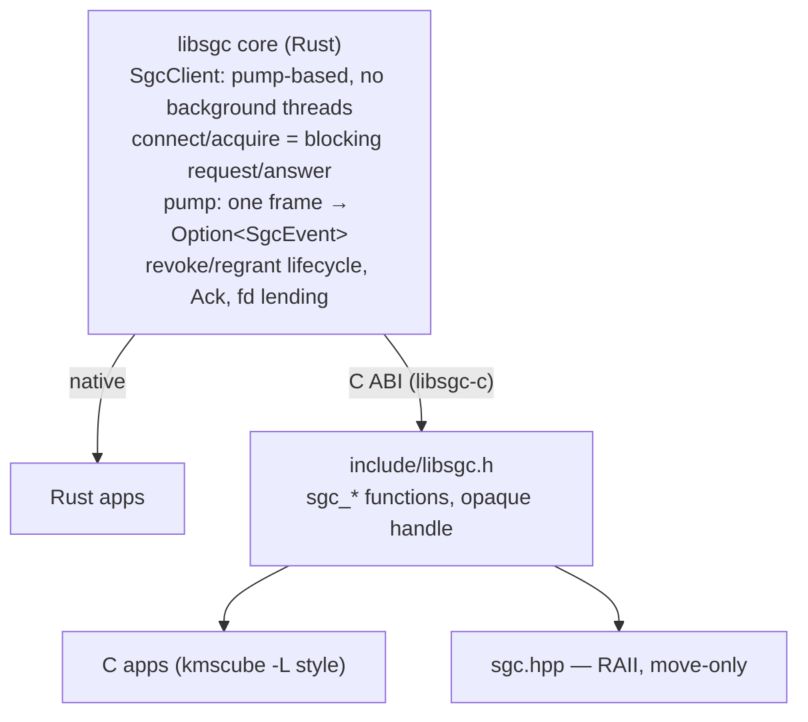
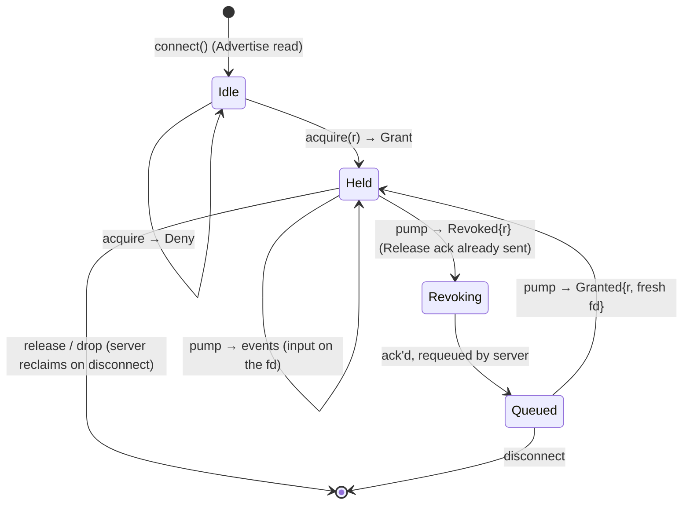

# libsgc client library — one core, three faces

Client library for the simple-graphics-controller daemon (`@sgc`), delivered
from ONE Rust core:

| face | consumer | where |
| --- | --- | --- |
| Rust | native crate: `SgcClient` + `SgcEvent` | this repo (`libsgc-rs`) |
| C | ABI `include/libsgc.h` over the core (opaque `sgc_client*`) | `libsgc-c` repo |
| C++ | header-only RAII `sgc.hpp` over the C ABI (no second implementation) | `libsgc-c` repo |

Why one core: the protocol is the expensive part (msgpack framing, SCM_RIGHTS
fds, the Ack timer, the ask-first revoke handshake, the revoke/requeue/regrant
lifecycle) and exists once, board-verified. Every other language gets a view
of that core, never a drifting second copy. The wire format is fixed by the
protocol crate (`simple-graphics-protocol`, `docs/PROTOCOL.md`) and pinned by
its `wire_dump` golden bytes.



## Client lifecycle



## The pump core

```rust
pub struct SgcClient { /* stream, held canonicals, pending acquire */ }

impl SgcClient {
    pub fn connect() -> Result<(Self, Vec<Resource>), SgcError>;
    pub fn acquire(&mut self, resource: Resource) -> Result<(), SgcError>;
    pub fn fd(&self, resource: &Resource) -> Result<OwnedFd, SgcError>; // dup
    pub fn held(&self) -> Vec<Resource>;
    /// Drive the protocol: one frame → event. Blocks up to `timeout`
    /// (None = until a frame/error); Ok(None) = nothing (re-pump).
    pub fn pump(&mut self, timeout: Option<Duration>)
        -> Result<Option<SgcEvent>, SgcError>;
}

pub enum SgcEvent {
    Revoked { resource: Resource },              // stop drawing, drop the dup
    Granted { resource: Resource, fd: OwnedFd }, // fresh dup, draw
}
```

Pump, not callbacks, because:

- C cannot express closures over `&mut SgcClient` — a pump is a plain call
  (`sgc_pump(client, timeout_ms)`), the caller loops like `poll()`.
- Re-entrancy is structurally impossible: `acquire()` only runs between
  pumps; `pump()` never invokes user code.
- Loop-shaped consumers (LVGL, game loops, kmscube's render loop) drive
  `pump()` from their own loop with a small timeout — no thread ownership.
- The protocol work (Ack after Grant, Release as revoke-ack) happens inside
  `pump()` before the event returns — every face gets correct wire behavior.

Disconnect: `pump` first returns `SgcEvent::Revoked` per still-held resource
(one per call), then the fatal error. `start_event_loop` = thin
callback wrapper over `pump(None)`.

### fd ownership

| side | rule |
| --- | --- |
| client | canonical fd per held resource, owned by `SgcClient`, dropped on revoke/disconnect |
| app | `fd()` returns a dup — close when the resource revokes |
| grant fd in `Granted` | owned by the app until the next `Revoked` |

### Errors (`SgcError`, the only type crossing the API)

| site | variant |
| --- | --- |
| connect: no server/refused | `ConnectFailed(io)` |
| connect: bad frame / not Advertise | `Protocol` / `UnexpectedMessage` |
| acquire: resource not offered | `NotAvailable { resource }` |
| acquire: server deny | `Denied { reason }` |
| acquire: grant without exactly 1 fd | `Io(InvalidData)` |
| wire / decode failure | `Io` / `Protocol` |
| `fd()` of an unheld resource | `NotHeld { resource }` |

EOF inside the loop is normal teardown, not an app error: held resources
drain as `Revoked`, then the error returns.

### Open item

Voluntary `release()` (hand a resource back without a revoke): check `held`,
write `Release`, drop the canonical. The server currently reclaims on
disconnect or preemption only.

## The C ABI (libsgc-c)

Shim crate: `#[repr(C)]` types + `extern "C"` fns over the core,
`catch_unwind` at every entry. Library name `sgc` → consumers link
`libsgc.a` / `libsgc.so` (musl = static, gnu = dynamic, per the workspace
convention; build with that repo's Justfile).

Resource kinds are flat ints (kind+index = full round-trip of the Rust enum):

| kind | index |
| --- | --- |
| 0 FBDEV | ignored |
| 1 DRM | card |
| 2 MOUSE / 3 KEYBOARD / 4 TOUCH | device |

```c
typedef struct sgc_client sgc_client;          /* opaque */
typedef struct { int kind; int index; } sgc_resource;
typedef struct {
    int kind;           /* SGC_EVENT_REVOKED | SGC_EVENT_GRANTED */
    sgc_resource resource;
    int fd;             /* GRANTED only: owned by caller, close() it */
} sgc_event;

sgc_client *sgc_connect(char *err, size_t err_len);          /* NULL on error */
int  sgc_advertised(sgc_client *c, sgc_resource **out, size_t *count);
void sgc_free(void *p);
int  sgc_acquire(sgc_client *c, sgc_resource r, char *err, size_t err_len);
int  sgc_pump(sgc_client *c, int timeout_ms, sgc_event *out, char *err, size_t err_len);
int  sgc_fd(sgc_client *c, sgc_resource r, char *err, size_t err_len); /* dup */
void sgc_release(sgc_client *c);                                 /* drop, NULL ok */
```

ABI rules:

- opaque handle, no layout exposed; enums are plain `int` constants (stable
  ABI size).
- fallible fns → `0` ok / `-1` (or `NULL`) + message in the `err` buffer
  (C analog of `SgcError`); `catch_unwind` at every entry; `sgc_advertised`
  signals failure with `-1` only.
- grant fd and `sgc_fd()` dups transfer ownership to the caller (header says
  so next to each fd-returning signature).
- `sgc_pump` → `1` event stored, `0` nothing, `-1` connection error;
  `timeout_ms` = `-1` block / `0` poll once / `>0` ms.
- advertised list = malloc'd array, freed with `sgc_free`.

Header is handwritten (~6 fns + 2 structs); cbindgen only if the surface
grows.

## The C++ face

`sgc.hpp` (header-only, same include dir) — RAII over the C ABI, no protocol
logic: `SgcClient` move-only (dtor → `sgc_release`), `Event` move-only
(closes its GRANTED fd), `Fd` wraps `sgc_fd` results, `pump`/`run` loop over
`sgc_pump` like the Rust `start_event_loop`.

## Tests

| level | what |
| --- | --- |
| core unit (this repo) | interactive fake controller: grant, deny, revoke-ack (Release observed), unsolicited regrant (Ack observed), disconnect drains one Revoked per held resource, bounded/zero pumps |
| shim unit (libsgc-c) | kind round-trips incl. u8 edges, invalid encodings, error-buffer truncation |
| C/C++ smoke (libsgc-c/tests/smoke) | compile + link gates against the staticlib (-Wall -Wextra), every symbol + error channel |
| board (sgc-demos) | sgc-drm-client + sgc-fbdev-client run the full grant / revoke / requeue / re-grant cycle against the real daemon |

## Source layout

```
libsgc-rs/            this repo — the core
  src/client.rs       SgcClient, pump(), SgcEvent
libsgc-c/             C ABI shim (lib name sgc), sibling repo
  include/libsgc.h    C contract (handwritten)
  include/sgc.hpp     C++ RAII wrapper
  tests/smoke/        main.c + main.cc
```
